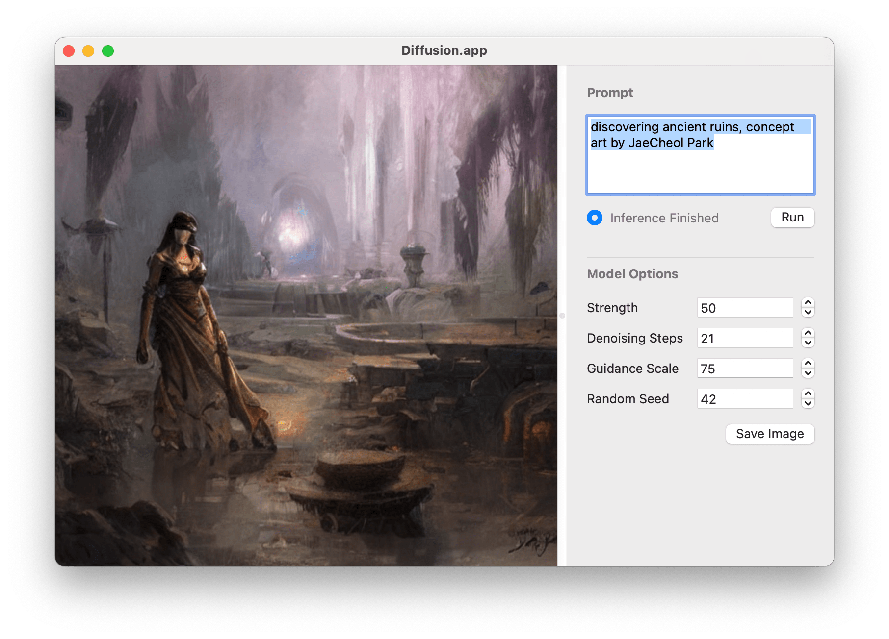

# Diffusion.app
> Native mac runner for Stable Diffusion 1.5

Diffusion.app is a native mac implementation of Stable Diffusion 1.5. It includes a full text-to-image inference pipeline and minimal Cocoa UI, and is implemented in Obj-C using CoreML.

## Screenshot

